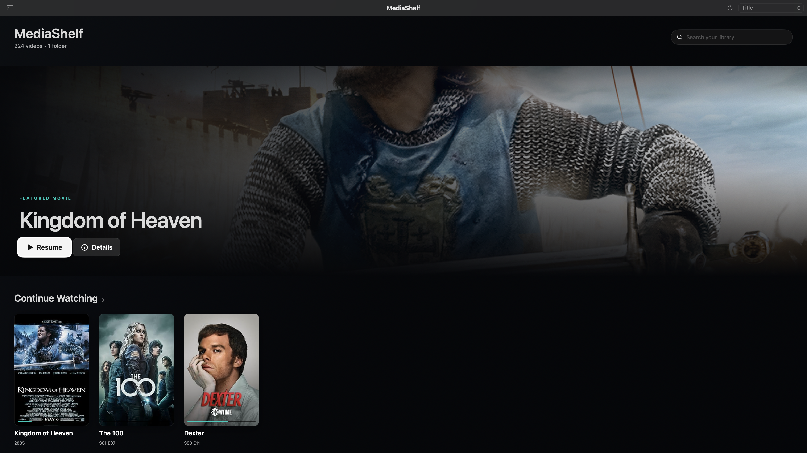
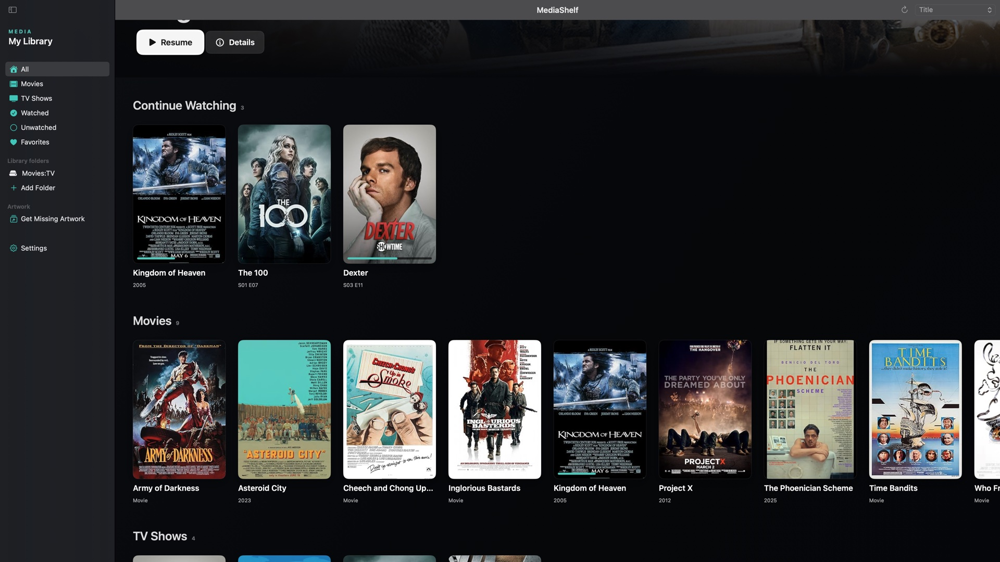
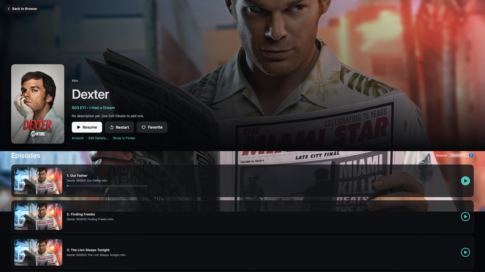
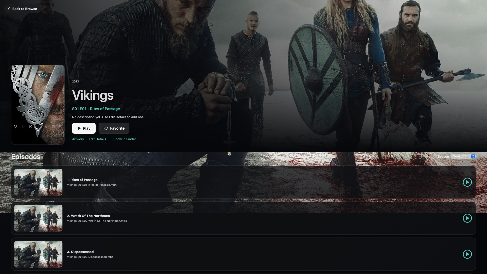

<p align="center">
  
</p>

<h1 align="center">MediaShelf</h1>

<p align="center">
  <strong>Your movies. Your drive. Your private streaming service.</strong>
</p>

<p align="center">
  Turn an external drive into a polished, portable movie and TV library—without a server, account, subscription, or cloud.
</p>

<p align="center">
  <a href="https://github.com/degenerateearth/MediaShelf/releases/latest/download/MediaShelf-macOS-Intel.zip"><strong>Download MediaShelf for Intel Mac</strong></a>
  ·
  <a href="https://github.com/degenerateearth/MediaShelf/releases/latest/download/MediaShelf.exe"><strong>Download MediaShelf for Windows</strong></a>
  ·
  <a href="linux/README.md"><strong>Linux AppImage</strong></a>
  ·
  <a href="#build-from-source">Build from source</a>
  ·
  <a href="docs/PRIVACY.md">Privacy</a>
</p>

<p align="center">
  <a href="https://github.com/degenerateearth/MediaShelf/issues/2"><strong>Windows alpha testers wanted — help us test the preview</strong></a>
</p>



## Screenshots

Click a screen for a closer look.

<p align="center">
  <a href="screenshots/library-browse.jpg"></a>
  <a href="screenshots/show-detail-dexter.jpg"></a>
  <a href="screenshots/show-detail-vikings.jpg"></a>
</p>

## A streaming experience for the media you already own

MediaShelf makes a folder of video files feel like a real living-room product. Point it at your library and it organizes movies, shows, seasons, and episodes into a cinematic interface with artwork, continue watching, automatic next-episode playback, and full Xbox controller navigation.

The unusual part is what MediaShelf does **not** require: there is no media server to maintain, no Docker stack, no account to create, no subscription to renew, and no library database stranded on one computer. Put MediaShelf on the same external drive as your collection and its database, artwork, settings, and playback progress travel with it.

## Why MediaShelf

| | |
|---|---|
| **Portable by design** | The app and `MediaShelf Data` folder live together on your external drive. Move the drive, keep the library. |
| **Actually private** | Your media stays local. Internet access is optional and used only to retrieve artwork and metadata. |
| **TV done properly** | Episodes collapse into one show entry, then open into season and episode pickers instead of flooding the library. |
| **Made for the couch** | Navigate, open the sidebar, play, pause, seek, and scrub with an Xbox controller. |
| **Broad playback** | The packaged build includes its playback stack for MP4, MKV, M4V, and MOV—no separate codec troubleshooting. |
| **Safe around your files** | MediaShelf indexes media; it never renames, moves, rewrites, or deletes the originals. |

## Highlights

- Premium, native macOS interface with a cinematic featured title and responsive content rails
- Continue Watching kept first, followed by Movies, TV Shows, and automatically generated genre sections
- One Continue Watching entry per series, always tracking the furthest episode watched
- Automatic next-episode playback and watched-state cleanup at completion
- Recursive library monitoring so newly added media appears on the next refresh
- Conservative automatic poster and backdrop matching that refuses ambiguous guesses
- **Get Missing Artwork** workflow with a visual match chooser when automation is uncertain
- Manual metadata and artwork overrides that survive rescans
- Search, sorting, filters, favorites, recently added, and watched/unwatched views
- Resume playback, timeline scrubbing, elapsed/remaining time, and autosaving progress
- Portable SQLite storage with automatic backups before schema migrations

## Controller map

| Xbox control | Library | Player |
|---|---|---|
| D-pad / left stick | Move focus and scroll rails | Reveal controls; left/right seek 10 seconds |
| A | Open or select | Play/pause |
| B | Open sidebar / go back | Return to details |
| X | — | Play/pause |
| LT / RT | — | Hold to rewind / fast-forward |
| Menu | Toggle navigation | Toggle playback controls |

## Download and run

1. Download [`MediaShelf-macOS-Intel.zip`](https://github.com/degenerateearth/MediaShelf/releases/latest/download/MediaShelf-macOS-Intel.zip).
2. Unzip it and copy `MediaShelf.app` to the external drive that will hold your library. Do not run it from a mounted installer image.
3. Open MediaShelf and choose your first media folder.
4. Let the first scan organize your collection and retrieve artwork.

MediaShelf currently targets **Intel Macs running macOS 13 or newer**. This community build is ad-hoc signed rather than Apple-notarized, so macOS may require a right-click → **Open** on first launch. Never eject the drive while MediaShelf is running; quit the app first.

## Portable layout

When you choose the first media folder, MediaShelf creates its data folder beside that folder. The database, artwork, playback progress, settings, and backups therefore stay on the same external drive as the library.

```text
External Drive/
├── MediaShelf Files/
│   ├── library.sqlite
│   ├── Artwork/
│   ├── Backups/
│   ├── Cache/
│   ├── Playback/
│   ├── Settings/
│   └── Thumbnails/
├── Movies & TV/
└── MediaShelf.app
```

Security-scoped bookmarks grant access only to folders you select. If macOS invalidates a bookmark after moving the drive to another Mac, select the same folder again; the portable database and playback history remain intact.

## Filename tips

MediaShelf understands common movie filenames and TV patterns such as:

```text
Movies/Alien (1979).mkv
TV/Dexter/Season 03/Dexter S03E11.mkv
TV/Vikings/Vikings 1x04.mp4
```

Clean titles and years improve artwork accuracy. When more than one exact match exists, MediaShelf leaves the item alone and lets you choose through **Get Missing Artwork** instead of silently applying the wrong poster.

## Build from source

Requirements:

- Intel Mac (`x86_64`)
- macOS 13+
- Xcode 16 or a Swift 5.10-compatible toolchain

```sh
git clone https://github.com/degenerateearth/MediaShelf.git
cd MediaShelf
swift test --arch x86_64
./scripts/build-app.sh
```

The packaged application is written to `dist/MediaShelf.app`. The build downloads FFmpegKit through Swift Package Manager and embeds the required playback components into the app bundle.

### Linux portable AppImage

An early GTK 3 edition with portable AppImage packaging for 64-bit Linux Mint
and Ubuntu-family distributions lives in [`linux/`](linux/README.md). It uses
system Celluloid for playback and can also run directly from a checkout or
install for the current user without root access.

## Project principles

1. **Local first.** Playback and library management must work without an account or server.
2. **Never gamble with media.** Index files; do not mutate them.
3. **Prefer no result to a wrong result.** Metadata automation should surface uncertainty instead of hiding it.
4. **The couch is a first-class platform.** Every primary journey should work with a controller.
5. **Portable means the whole experience.** Artwork, progress, settings, and backups belong with the library.

## Documentation

- [Contributing](CONTRIBUTING.md)
- [Architecture](docs/ARCHITECTURE.md)
- [Apple Silicon support plan](docs/APPLE_SILICON_PLAN.md)
- [Windows portable preview](docs/WINDOWS.md)
- [Linux GTK preview](linux/README.md)
- [Playback](docs/PLAYBACK.md)
- [Portable storage](docs/PORTABILITY.md)
- [Privacy and online artwork](docs/PRIVACY.md)
- [Testing](docs/TESTING.md)
- [Known limitations](docs/KNOWN_LIMITATIONS.md)

## Status

MediaShelf is an early public release built and tested on Intel macOS. Bug reports and focused contributions are welcome; please read [CONTRIBUTING.md](CONTRIBUTING.md) first. Do not include copyrighted media, API credentials, cached artwork, private paths, or personal library databases in issues or pull requests.

## License

MediaShelf is available under the [MIT License](LICENSE). Bundled and package-managed playback components retain their respective licenses. Artwork and metadata returned by optional providers remain subject to their providers' terms.
